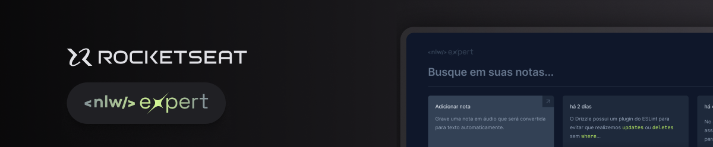
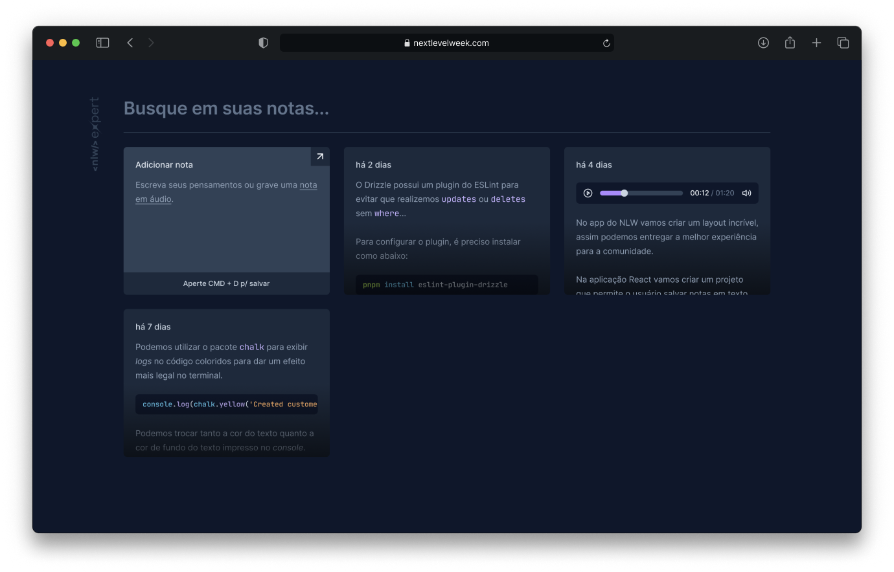

  

 

  
  <a aria-label="Completed" href="https://rocketseat.com.br/">
    </img>
  </a>

## :speech_balloon: Sobre

Este projeto foi desenvolvido na trilha de React JS da NLW Expert da [Rocketseat](https://www.rocketseat.com.br). 
 
Neste projeto é possível criar notas de texto ou realizar a transcrição de áudio para texto utilizando a API [SpeechRecognition](https://developer.mozilla.org/en-US/docs/Web/API/SpeechRecognition) nativa do browser. 

## :camera: Preview 

  

## :rocket: Tecnologias Utilizadas

  
  
  
  
 

  Feito com :purple_heart:

